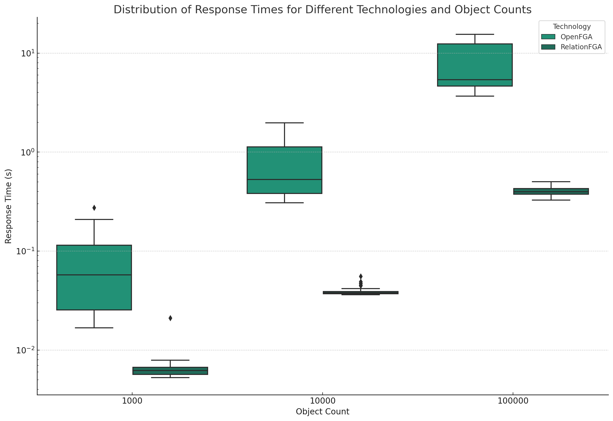

RELATION FGA
============
Implementation of (F)ine (G)rade (A)uthorization inspired by OpenFGA

The motivation behind this project was to create a service that could handle the object list better than OpenFGA https://openfga.dev/. The mentioned solution is based on a relational database. The topic of permissions and accesses in my opinion is graphical in nature, so I decided to try it with graphs, preliminary benchmarks show a very big performance difference.

# How it works:
1. the DSL logic is parsed using ply to graph in networkx. An AuthModel is created
2. the AuthModelService using the AuthService generates access paths on the graph from object A to object B. It filters them by the required permissions
3. the access paths are converted into cypher commands that fly to memgraph.
4. everything is wrapped in the grpc client

# Benchmark
3 tests were conducted: 

    -1000 objects
    -10,000 objects
    -100,000 objects

For one user with id "1" who has relatively the most connections 100 requests for his access were carried out

As you can see, RelationFGA is almost an order of magnitude faster than OpenFga. All the files needed to run the benchmark with instructions are in the src/benchmark path

# Disclaimer
I am very open to criticism, I probably made mistakes

DEV GUIDE
---------
SETUP:
    - cp example.envs .envs and fill ANTHROPIC_API_KEY if You want to use overseer chat
    - create venv
    - install requirements.txt from:
        compose/grpc/requirements.txt
        compose/overseer_backend/requirements.txt
        src/examples/simple_backend/requirements.txt

RUN APP:

    $ docker compose build
    $ docker compose up

RUN example server:

    $ uvicorn examples.simple_backend.main:app

Services:
1. localhost - overseer chat
2. localhost:4000 - memgraph lab
3. localhost/grpc - grpc server for OpenFga
4. localhost/overseer - overseer backend (websocket endpoint)

PROTOS:

run commands from graph_fga/grpc folder:

    $ python -m grpc_tools.protoc -I./protos --python_out=./pb2 --pyi_out=./pb2 --grpc_python_out=./pb2 protos/messages.proto
    $ python -m grpc_tools.protoc -I./protos --python_out=./pb2 --pyi_out=./pb2 --grpc_python_out=./pb2 protos/services.proto

edit file services_pb2_grpc first line to:

    from . import messages_pb2 as messages__pb2

TESTS:

GRPC tests:

    $ docker compose run server_grpc pytest
